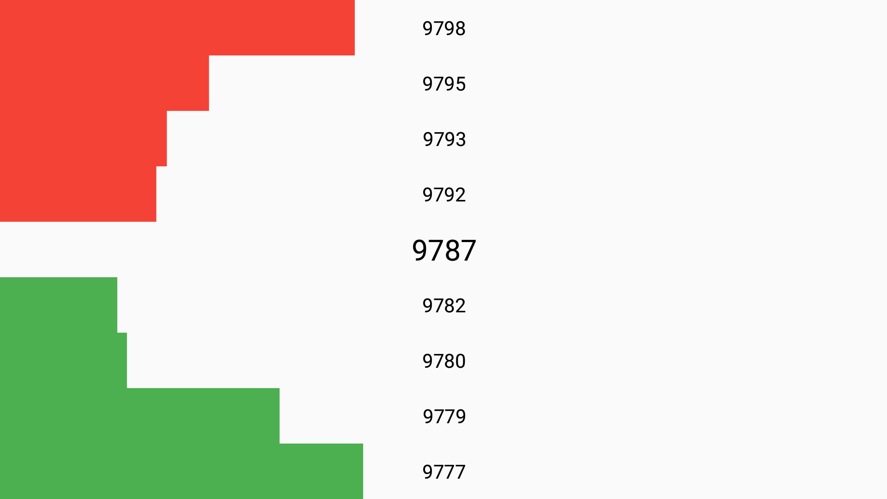

# Order-book-visualisation app
A small order book visualization tool. Order book stores buy (bid) and sell (ask) requests for a financial instrument. Visualizing the order book shows the price levels and quantity of an instrument available per level to give a quick visualization for market participants on how much there is supply and demand for various prices.

- Application works in portrait and landscape orientation
- App is written in Java
- No third party libraries are used, except Mockito in some Unit tests, and androidx (support libs) 
that were declared in Android Studio project by default e.g. ConstraintLayout
- App follows MVP pattern and some clean code paradigms, the simulator generating order events 
should be considered as "data" layer and it uses "Timer-X" thread to post events.

## Potential TODOs:
- UI test
